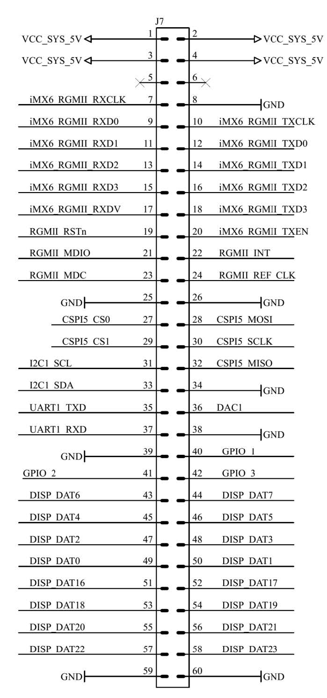

# Expansion Port - 60 pin Bottom Port

The bottom facing Expansion port is designed to allow accessory board development.

The connector on the Kernel camera stack bottom Connector Board is the [Hirose DF40C-60DP-0.4V\(51\)](http://tinyurl.com/h3w6h66). An expansion board would require the mating component [Hirose DF40HC\(4.0\)-60DS-0.4V\(51\)](https://www.hirose.com/product/en/products/DF40/DF40HC%284.0%29-60DS-0.4V%2851%29/).

| **Pin** | **Label** | **I/O Voltage** | **Default Function** | **Alt. Function 1** | **Alt. Function 2** |
| :--- | :--- | :--- | :--- | :--- | :--- |
| 1 | VCC\_SYS\_5V |  | 5V Power |  |  |
| 2 | VCC\_SYS\_5V |  | 5V Power |  |  |
| 3 | VCC\_SYS\_5V |  | 5V Power |  |  |
| 4 | VCC\_SYS\_5V |  | 5V Power |  |  |
| 5 | X |  | NC |  |  |
| 6 | X |  | NC |  |  |
| 7 | RGMII\_RXC | 1.8 V | RCMII\_RXC \(Ethernet\) | GPIO6\_IO30 |  |
| 8 | GND |  | GROUND |  |  |
| 9 | RCMII\_RD0 | 1.8 V | RCMII\_RD0 \(Ethernet\) | GPIO6\_IO25 |  |
| 10 | RCMII\_TXC | 1.8 V | RCMII\_TXC \(Ethernet\) | GPIO6\_IO19 |  |
| 11 | RCMII\_RD1 | 1.8 V | RCMII\_RD1 \(Ethernet\) | GPIO6\_IO27 |  |
| 12 | RCMII\_TD0 | 1.8 V | RCMII\_TD0 \(Ethernet\) | GPIO6\_IO20 |  |
| 13 | RCMII\_RD2 | 1.8 V | RCMII\_RD2 \(Ethernet\) | GPIO6\_IO28 |  |
| 14 | RCMII\_TD1 | 1.8 V | RCMII\_TD1 \(Ethernet\) | GPIO6\_IO21 |  |
| 15 | RCMII\_RD3 | 1.8 V | RCMII\_RD3 \(Ethernet\) | GPIO6\_IO29 |  |
| 16 | RCMII\_TD2 | 1.8 V | RCMII\_TD2 \(Ethernet\) | GPIO6\_IO22 |  |
| 17 | RCMII\_RX\_CTL | 1.8 V | RCMII\_RX\_CTL \(Ethernet\) | GPIO6\_IO24 |  |
| 18 | RCMII\_TD3 | 1.8 V | RCMII\_TD3 \(Ethernet\) | GPIO6\_IO23 |  |
| 19 | ENET\_CRS\_DV | 1.8 V | RCMII\_RSTN \(Ethernet\) |  |  |
| 20 | RCMII\_TX\_CTL | 1.8 V | RCMII\_TX\_CTL \(Ethernet\) | GPIO6\_IO26 |  |
| 21 | ENET\_MDIO | 1.8 V | ENET\_MDIO \(Ethernet\) | GPIO6\_IO22 |  |
| 22 | ENET\_RXD1 | 1.8 V | ENET_1588_ EVENT3\_OUT \(Ethernet\) | GPIO6\_IO26 |  |
| 23 | ENET\_MDC | 1.8 V | RCMII\_MDC  \(Ethernet\) | GPIO6\_IO22 |  |
| 24 | ENET\_REF\_CLK | 1.8 V | ENET\_TX\_CLK \(Ethernet\) | GPIO6\_IO23 |  |
| 25 | GND |  | GROUND |  |  |
| 26 | GND |  | GROUND |  |  |
| 27 | EIM\_D21 | 3.3 V | 12SCL | GPIO3\_IO21 |  |
| 28 | SD2\_CMD | 3.3 V | GPIO3\_IO21 |  |  |
| 29 | EIM\_D28 | 3.3 V | I2C1\_SDA | GPIO3\_IO28 |  |
| 30 | SD2\_CMD | 3.3 V | GPIO1\_IO11 |  |  |
| 31 | GPIO\_7 | 3.3 V | UART\_TX\_DATA | GPIO1\_IO07 | FLEXCAN1\_TX |
| 32 | SD2\_DAT0 | 3.3 V | GPIO\_IO15 |  |  |
| 33 | GPIO\_8 | 3.3 V | UART2\_RX\_DATA | GPIO1\_IO08 | FLEXCAN1\_RX |
| 34 | GND |  | GROUND |  |  |
| 35 | GND |  | GROUND |  |  |
| 36 | DAC |  | Analog Video out |  |  |
| 37 | GND |  | GROUND |  |  |
| 38 | GND |  | GROUND |  |  |
| 39 | X |  | X |  |  |
| 40 | NANDF\_D1 | 3.3 V | GPIO2\_IO01 |  |  |
| 41 | NANDF\_D2 | 3.3 V | GPIO2\_IO02 |  |  |
| 42 | NANDF\_D3 | 3.3 V | GPIO2\_IO03 |  |  |
| 43 | DISP0\_DAT6 | 3.3 V | ECSPI3\_SS3 | GPIO4\_IO27 |  |
| 44 | DISP0\_DAT7 | 3.3 V | ECSPI3\_RDY | GPIO4\_IO28 |  |
| 45 | DISP0\_DAT4 | 3.3 V | ECSPI3\_SS1 | GPIO4\_IO25 |  |
| 46 | DISP0\_DAT5 | 3.3 V | ECSPI3\_SS2 | GPIO4\_IO26 |  |
| 47 | DISP0\_DAT2 | 3.3 V | ECSPI3\_MISO | GPIO4\_IO23 |  |
| 48 | DISP0\_DAT3 | 3.3 V | ECSPI3\_SS0 | GPIO4\_IO24 |  |
| 49 | DISP0\_DAT0 | 3.3 V | ECSPI3\_SCLK | GPIO4\_IO21 |  |
| 50 | DISP0\_DAT1 | 3.3 V | ECSPI3\_MOSI | GPIO4\_IO22 |  |
| 51 | DISP0\_DAT16 | 3.3 V | GPIO4\_IO10 | ECSPI2\_MOSI |  |
| 52 | DISP0\_DAT17 | 3.3 V | GPIO4\_IO11 | ECSPI2\_MISO |  |
| 53 | DISP0\_DAT18 | 3.3 V | AUD4\_RXFS | ECSPI2\_SS0 | GPIO4\_IO12 |
| 54 | DISP0\_DAT19 | 3.3 V | AUD4\_RXC | ECSPI2\_SCLK | GPIO4\_IO13 |
| 55 | DISP0\_DAT20 | 3.3 V | AUD4\_TXC | ECSPI1\_SCLK | GPIO4\_IO14 |
| 56 | DISP0\_DAT21 | 3.3 V | AUD4\_TXD | ECSPI1\_MOSI | GPIO4\_IO15 |
| 57 | DISP0\_DAT22 | 3.3 V | AUD4\_TXFS | ECSPI1\_MISO | GPIO4\_IO16 |
| 58 | DISP0\_DAT23 | 3.3 V | AUD4\_RXD | ECSPI1\_SS0 | GPIO4\_IO17 |
| 59 | GND |  | GROUND |  |  |
| 60 | GND |  | GROUND |  |  |

