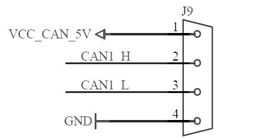
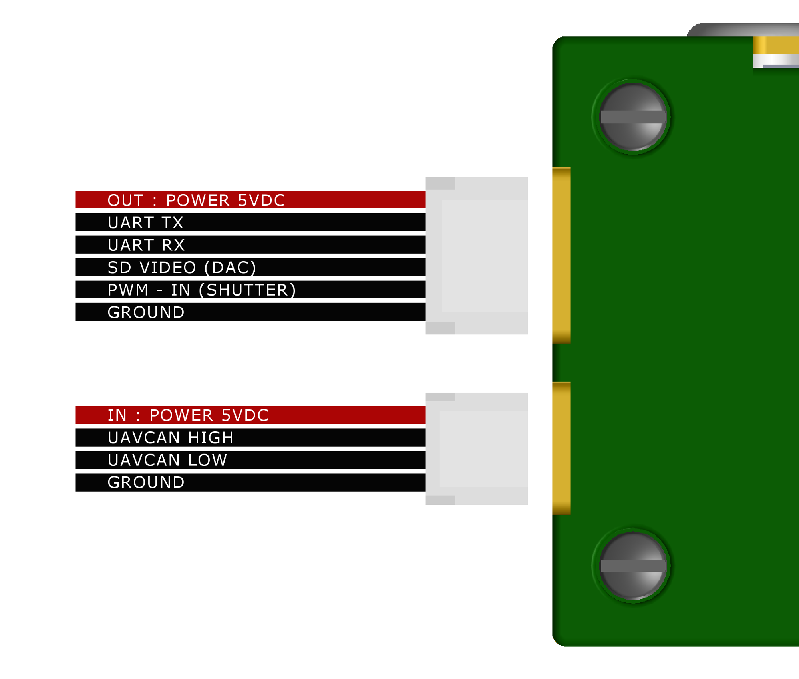

# UAVCAN/PWR Port - 4 pin Side Port

The 4pin UAVCAN port on an individual Kernel is used to add telemetry data to the images as they are captured. The port is a [JST SM04B-GHS-TB](http://tinyurl.com/jjkkat2) and mates with a plug [JST GHR-04V-S](http://www.digikey.com/product-detail/en/jst-sales-america-inc/GHR-04V-S/455-1594-ND/807816). You can also supply the 5VDC to power the camera with this port.

| **Pin** | **Label** | **Default Function** |
| :--- | :--- | :--- |
| 1 | VCC\_CAN\_5V | 5V Power |
| 2 | CAN1\_H | UAVCAN |
| 3 | CAN1\_L | UAVCAN |
| 4 | GND | GROUND |

