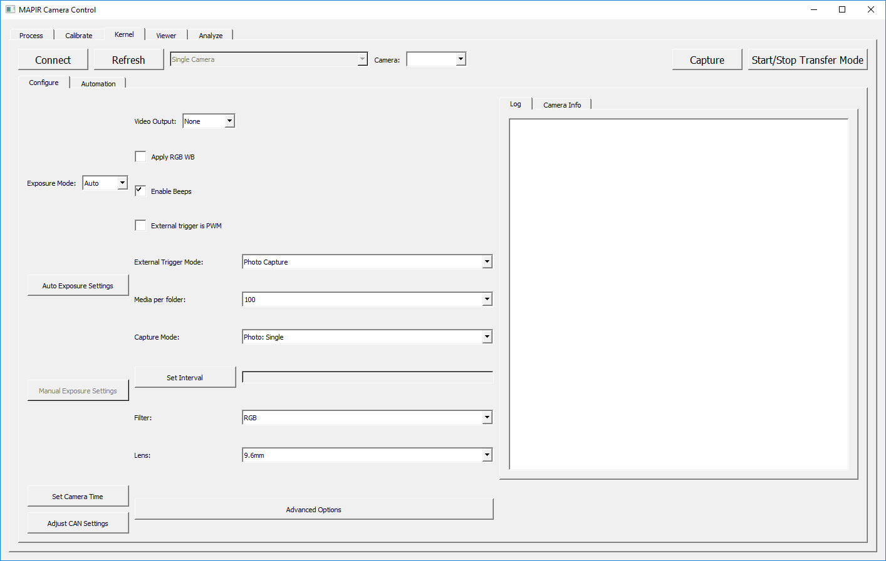

# MCC: MAPIR Camera Control Application

Our MAPIR Camera Control \(MCC\) software is what you will use to interact with Kernel, as well as process images. In the following sections, we'll go over how to use the interface and also show some of the code behind the scenes for those that need lighter weight scripts or want to control our cameras from their own application.

## [Installing MAPIR Camera Control \(MCC\) Application](https://mapir-camera.gitbook.io/kernel-development-guide/interfacing-with-kernel/software-interface/mcc/installation)

## [Connecting to Kernel Cameras Using MCC](https://mapir-camera.gitbook.io/kernel-development-guide/interfacing-with-kernel/software-interface/mcc/connecting-to-kernel)

## [Changing Camera Settings From MCC](https://mapir-camera.gitbook.io/kernel-development-guide/interfacing-with-kernel/software-interface/mcc/changing-camera-settings)

## [Capturing Images From MCC](https://mapir-camera.gitbook.io/kernel-development-guide/interfacing-with-kernel/software-interface/mcc/capturing-images)

## [Capturing Video From MCC](https://mapir-camera.gitbook.io/kernel-development-guide/interfacing-with-kernel/software-interface/mcc/capturing-video)

## [Transferring Media Via USB](https://mapir-camera.gitbook.io/kernel-development-guide/interfacing-with-kernel/software-interface/mcc/transferring-media)

