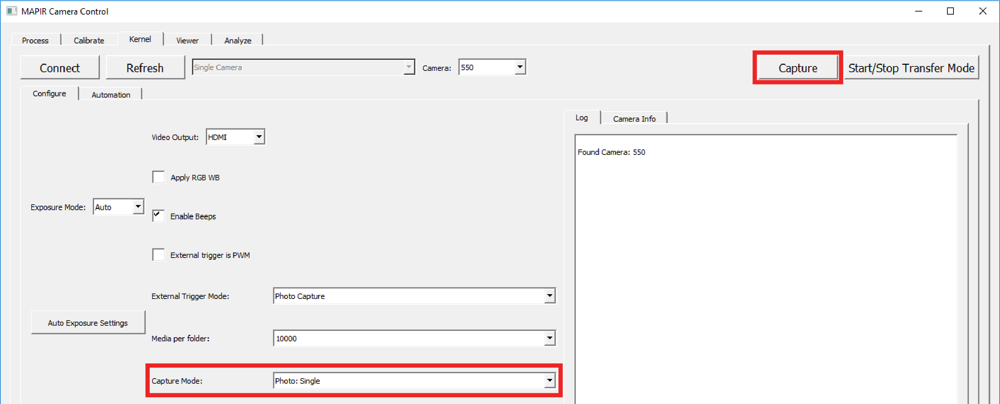

# Capturing Images

Capturing images with the control app is accomplished by choosing a photo mode in the "Capture Mode" drop-down and then clicking the "Capture" button. The cameras will then all capture an image, though they will not be in sync \(use relay/PWM pulse for sync\).

