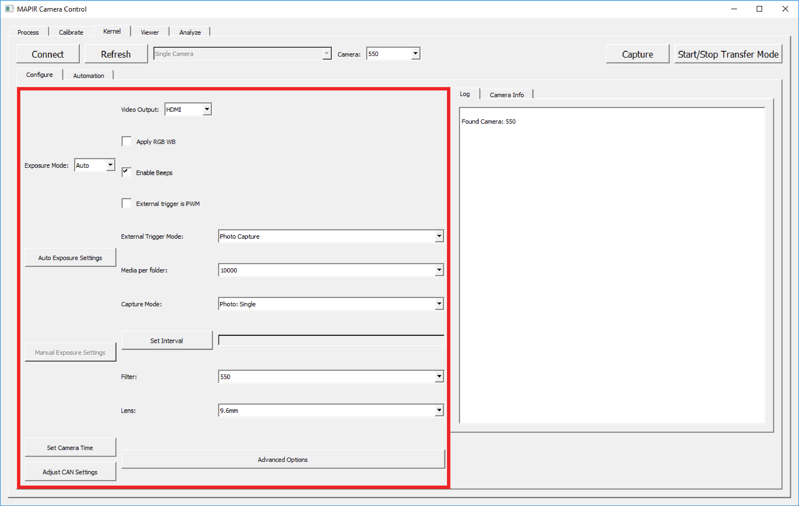

# Changing Camera Settings

## Changing Camera Settings

To adjust a camera's settings, simply select the camera from the top drop-down and then adjust the setting fields within the red box labeled below. As you make changes they are saved to the camera automatically. Click the following links to learn about each option.

## [Default Settings](https://mapir-camera.gitbook.io/kernel-development-guide/interfacing-with-kernel/software-interface/mcc/changing-camera-settings/default-settings)

## [Exposure Mode](https://mapir-camera.gitbook.io/kernel-development-guide/interfacing-with-kernel/software-interface/mcc/changing-camera-settings/exposure-mode)

## [Auto Exposure Settings](https://mapir-camera.gitbook.io/kernel-development-guide/interfacing-with-kernel/software-interface/mcc/changing-camera-settings/exposure-mode/auto-exposure-settings)

## [Manual Exposure Settings](https://mapir-camera.gitbook.io/kernel-development-guide/interfacing-with-kernel/software-interface/mcc/changing-camera-settings/exposure-mode/manual-exposure-settings)

## [Setting Camera Time](https://mapir-camera.gitbook.io/kernel-development-guide/interfacing-with-kernel/software-interface/mcc/changing-camera-settings/setting-real-time-clock)

## [Adjust CAN Settings](https://mapir-camera.gitbook.io/kernel-development-guide/interfacing-with-kernel/software-interface/mcc/changing-camera-settings/changing-can-setings)

## [Video Output](https://mapir-camera.gitbook.io/kernel-development-guide/interfacing-with-kernel/software-interface/mcc/changing-camera-settings/video-output)

## [Apply RGB White Balance](https://mapir-camera.gitbook.io/kernel-development-guide/interfacing-with-kernel/software-interface/mcc/changing-camera-settings/apply-rgb-wb)

## [Enable Beeps](https://mapir-camera.gitbook.io/kernel-development-guide/interfacing-with-kernel/software-interface/mcc/changing-camera-settings/enable-beeps)

## [External Trigger is PWM](https://mapir-camera.gitbook.io/kernel-development-guide/interfacing-with-kernel/software-interface/mcc/changing-camera-settings/external-trigger-is-pwm)

## [External Trigger Mode](https://mapir-camera.gitbook.io/kernel-development-guide/interfacing-with-kernel/software-interface/mcc/changing-camera-settings/external-trigger-mode)

## [Media Per Folder](https://mapir-camera.gitbook.io/kernel-development-guide/interfacing-with-kernel/software-interface/mcc/changing-camera-settings/media-per-folder)

## [Capture Mode](https://mapir-camera.gitbook.io/kernel-development-guide/interfacing-with-kernel/software-interface/mcc/changing-camera-settings/capture-mode)

## [Set Interval](https://mapir-camera.gitbook.io/kernel-development-guide/interfacing-with-kernel/software-interface/mcc/changing-camera-settings/set-interval)

## [Filter Drop-Down](https://mapir-camera.gitbook.io/kernel-development-guide/interfacing-with-kernel/software-interface/mcc/changing-camera-settings/filter-drop-down)

## [Lens Drop-Down](https://mapir-camera.gitbook.io/kernel-development-guide/interfacing-with-kernel/software-interface/mcc/changing-camera-settings/lens-drop-down)

## [Advanced Options](https://mapir-camera.gitbook.io/kernel-development-guide/interfacing-with-kernel/software-interface/mcc/changing-camera-settings/advanced-options)

