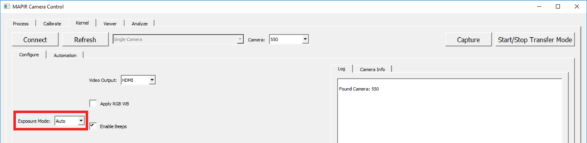

# Exposure Mode

Kernel cameras support 2 exposure modes: Auto and Manual.

Depending on what you are using the captured media for and how you will process it depends on what mode you should use. Click the links below to learn more about each mode.

## [Auto Exposure Settings](https://mapir-camera.gitbook.io/kernel-development-guide/interfacing-with-kernel/software-interface/mcc/changing-camera-settings/exposure-mode/auto-exposure-settings)

## [Manual Exposure Settings](https://mapir-camera.gitbook.io/kernel-development-guide/interfacing-with-kernel/software-interface/mcc/changing-camera-settings/exposure-mode/manual-exposure-settings)

