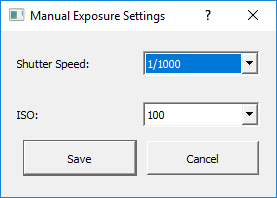

# Manual Exposure Settings

Manual exposure allows you to lock in a particular exposure setting.

## Shutter Speed:

Shutter speed \(or exposure time\) represents how long the sensor will capture light. The smaller the number in the fraction \(i.e. the 250 in 1/250\) the longer or slower the shutter will be \(stay open\). The longer it stays open the more light gets captured by the sensor.

If the camera is moving quickly over its subject matter there is a limit to how long you can leave the shutter open before you get unwanted pixel blur. Please use our flight calculator at the bottom of the page [here](https://www.mapir.camera/pages/cameras) and look at the value towards the bottom labeled "Min Shutter S 1/X s". You want to set a higher X value in this "Shutter Speed" setting than the flight calculator provides you.

**We recommend the following settings \(or faster/higher\) depending on the sensor being used \(you can adjust as desired\):**

3.2MP Sensors: **1/250**  
14MP Sensors: **1/500**

### Note: Due to the way the 14.4MP Kernel sensor is triggered to insure synced exposures in an array you may experience large portions of the captured media having over-exposed pixels if the shutter speed is not set to 1/500s or faster \(i.e. 1/1000s\).

## ISO:

ISO relates directly to the gain of the sensor, with lower values producing less image noise \(preferred\). Increasing the ISO allows you to use faster shutter speeds, useful if the ambient lighting is low or you need to use a faster shutter speed to not have pixel blur.

