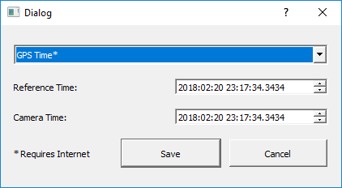

# Set Camera Time

This window allows you to set the time on the camera.

#### It is recommended to click the Save button and then relaunch the set camera window. Repeat this until the times match closely. Sometimes the program isn't able to update the camera at precisely the moment you click the Save button.

## Choose in the drop-down which time you would like to set the camera to:

### GPS Time:

Global Positioning System time, is the atomic time scale implemented by the atomic clocks in the GPS ground control stations and the GPS satellites themselves. GPS time was zero at 0h 6-Jan-1980 and since it is not perturbed by leap seconds GPS is now ahead of UTC by 18 seconds \(as of January 2018\).

### UTC Time:

Coordinated Universal Time, popularly known as GMT \(Greenwich Mean Time\), or Zulu time. Local time differs from UTC by the number of hours of your timezone.

### Local \(System\) Time:

The date/time reported by your computer \(as seen by your web browser\). If your PC clock is accurate to a second then the other time scales displayed above will also be accurate to within one second.

_Above explainations from:_ [_http://leapsecond.com/java/gpsclock.htm_](http://leapsecond.com/java/gpsclock.htm)

