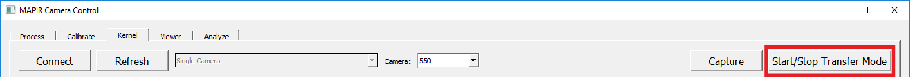
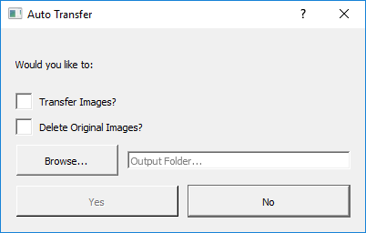

# Transferring Media

Transfer mode mounts the SD cards inside each Kernel camera to your computer so you can browse the contents. At this point in time Transfer mode only works with 32GB or smaller capacity FAT32 formatted cards.

To enter Transfer mode, make sure you have clicked the Connect button and found all the connected cameras \(names should show up in the log\). Then click the "Start/Stop Transfer Mode" button. The cameras will go into Transfer mode one at a time. Their SD cards will begin showing up on your computer.

Once all the SD cards are mounted MCC will pop up a window: 

## Checking the "Transfer Images" box will transfer the contents of the SD cards of all cameras to the "Output Folder" location.

## Checking the "Delete Original Images" box will delete the contents on the SD cards of all cameras AFTER transferring is complete.

## Click the "Browse" button to choose the location to transfer the contents of the SD cards of all cameras to. A folder will be created per camera named after the camera's 3 character name.

If you want to manage the files on the camera's SD card yourself then you can simply close this window.

When you want to stop Transfer mode simply click the "Start/Stop Transfer Mode" button.

If you decide to Format the cards while they are in the camera it is likely that you will not be able to exit Transfer mode without having an error show up in the log output. This is fine, simply power cycle the cameras and the cards will be formatted and the cameras will no longer be in Transfer mode. Make sure to also click the "Start/Stop Transfer Mode" button if you have not already done so as the application needs it unchecked in order to function properly.

