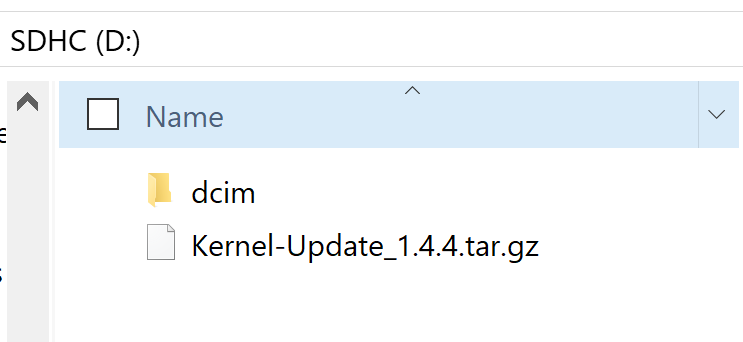

# Updating Kernel Firmware

**If your firmware is older than 1.4.1 please update to 1.4.1 using the** [**legacy updating instructions**](legacy-kernel-firmware-update-procedure.md) **prior to updating to the newer firmware.**

## **Firmware Download:** [**HERE**](kernel-firmware.md)\*\*\*\*

## Updating Instructions:

1. Updating the firmware for the Kernel cameras is as easy as putting the firmware file on the root directory \(highest level in the file structure\), next to the dcim folder \(see photo below\).  
2. You can do this by either copying the file to the SD card when it is in your computer, or when the SD card is mounted to your computer using [Transfer mode of MCC](../mcc/transferring-media.md). You can copy the firmware file to all camera SD cards in the array, and thus now update all cameras at the same time.
3. Once the firmware file is on the SD card exit out of Transfer mode \(if applicable\) and simply reboot the camera to begin the firmware update.
4. During boot the camera will look for the firmware file and if found will begin flashing both LEDs an orange color.
5. Firmware update is complete when both LEDs are solid blue color. The firmware file will be automatically deleted from the SD card.
6. You can now perform a power cycle and use the updated camera.

