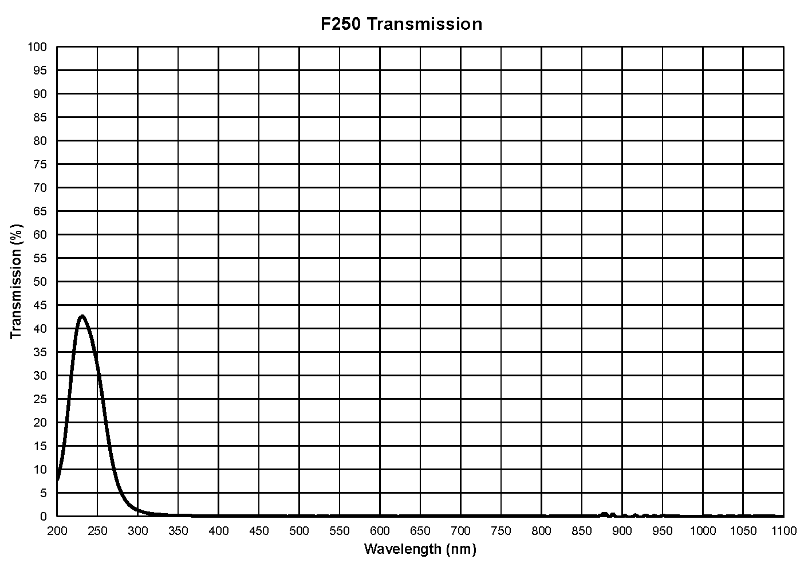
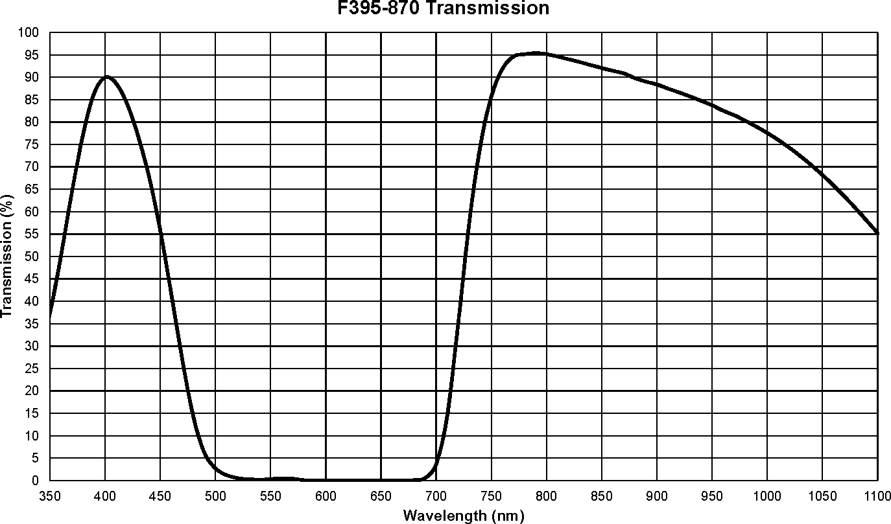

# Filter Transmission Data

### Kernel uses a threaded internal glass filter to block certain wavelengths of light from reaching the sensor.

**Outer Diameter Threads:** 25.4mm x 1-32 UN 2A \(C Mount\) pitch  
**Clear Aperture:** 9.0mm  
**Filter Mount Thickness:** 3.0mm  
**Mount Material:** Black Anodized Aluminum  
**Filter Glass Thickness:** 1.0mm  
**Filter Glass Surface Quality:** 40/20

| Filter Model Name | Recommended Sensor Type | Peak Wavelength | Transmission Range \(50%\) | Transmission Chart | Typical Uses |
| :--- | :--- | :--- | :--- | :--- | :--- |
| F250 | MONO | 230nm | 216-256nm \(25% Range\) | [VIEW](filter-transmission-data.md#f250) | Ultraviolet \(UV\) light detection |
| F350 | MONO | 350nm | 342-358nm | VIEW | Ultraviolet \(UV\) light detection |
| F390 | MONO | 390nm |  | VIEW | Ultraviolet \(UV\) light detection |
| F405 | MONO | 405nm | 400-415nm | [VIEW](filter-transmission-data.md#f405) | Ultraviolet \(UV\) light detection |
| F450 | MONO | 450nm | 429-459nm | [VIEW](filter-transmission-data.md#f450) | Blue light indices |
| F490 | MONO | 490nm | 468-506nm | [VIEW](filter-transmission-data.md#f490) | Blue/Green light indices |
| F510 | MONO | 510nm | 504-522nm | VIEW | Blue/Green indices |
| F518 | MONO | 518nm | 507-527nm | [VIEW](filter-transmission-data.md#f518) | Green light indices |
| F550 | MONO | 550nm | 535-565nm | [VIEW](filter-transmission-data.md#f550) | Green light indices |
| F590 | MONO | 590nm | 574-606nm | [VIEW](filter-transmission-data.md#f590) | Yellow light indices |
| F615 | MONO | 615nm | 603-624nm | [VIEW](filter-transmission-data.md#f615) | Orange light indices |
| F632 | MONO | 632nm | 625-655nm | [VIEW](filter-transmission-data.md#f632) | Red light indices |
| F650 | MONO | 650nm | 641-672nm | [VIEW](filter-transmission-data.md#f650) | Red light indices |
| F685 | MONO | 685nm | 674-698nm | [VIEW](filter-transmission-data.md#f685) | Red light indices |
| F709 | MONO | 709nm |  | VIEW | Red-edge indices |
| F725 | MONO | 725nm | 712-735nm | [VIEW](filter-transmission-data.md#f725) | Red-edge indices |
| F750 | MONO | 750nm | 720-765nm | VIEW | Red-edge indices |
| F780 | MONO | 780nm | 762-796nm | [VIEW](filter-transmission-data.md#f780) | Red-edge indices |
| F808 | MONO | 808nm | 801-815nm | [VIEW](filter-transmission-data.md#f808) | NIR light indices |
| F830 | MONO | 830nm | 813-844nm | VIEW | NIR light indices |
| F850 | MONO | 850nm | 835-865nm | [VIEW](filter-transmission-data.md#f850) | NIR light indices |
| F880 | MONO | 880nm | 867-893nm | [VIEW](filter-transmission-data.md#f880) | NIR light indices |
| F905 | MONO | 905nm | 892-920nm | [VIEW](filter-transmission-data.md#f905) | NIR light indices |
| F940 | MONO | 940nm | 905-965nm | [VIEW](filter-transmission-data.md#f940) | NIR light indices |
| F945 | MONO | 945nm | 941-949nm | [VIEW](filter-transmission-data.md#f945) | NIR light indices |
| F1000 | MONO | 1000nm | 915-1045nm | [VIEW](filter-transmission-data.md#f1000) | NIR light indices |
| F644 | RGB | X | 395-638nm | [VIEW](filter-transmission-data.md#f644-rgb) | Visible light RGB only \(Cut-off 648nm\) |
| FUVN | RGB | 395nm & 870nm | 375-425nm & 745-970nm | [VIEW](filter-transmission-data.md#f-395-870-uvn) | UV+NIR, Atmospheric indices |
| FNGB | RGB | 475nm & 550nm & 850nm | 468-483nm & 543-558nm & 835-865nm | [VIEW](filter-transmission-data.md#f-475-550-850-ngb) | NGB, ENDVI, improved NDVI |
| FOCN | RGB | 490nm & 615nm & 808nm | 476-512nm & 598-640nm & 798-848nm | [VIEW](filter-transmission-data.md#f-490-615-808-ocn) | OCN, NDVI, GNDVI, CVI, NG, NNIR, NR, TVI |
| FRGN | RGB | 550nm & 660nm & 850nm | 543-558nm & 653-668nm & 835-865nm | [VIEW](filter-transmission-data.md#f-550-660-850-rgn) | RGN, NDVI, GNDVI, CVI, NG, NNIR, NR, TVI |

## Top Lens Protector

### The clear glass lens protector on Kernel provides a sealed, abrasion resistant aperture. You can thread additional filters on top of the LP but do not suggest it due to increased vignetting that may result.

**Outer Diameter:** 24.0mm  
**Threads:** 22.5mm x 0.5mm pitch  
**Clear Aperture:** 18.5mm  
**Filter Mount Thickness:** 7.0mm  
**Filter Glass Thickness:** 1.0mm  
**Mount Material:** Black Anodized Aluminum

**Useful Transmission Range:** 350-1100nm  
**Cut-on Wavelength 50% Transmission:** 330nm  
**Tolerance:** +/- 10nm  
**Peak Transmission:** &gt;90%  
**Surface Quality:** 40/20

[Download Data](https://drive.google.com/file/d/1e9ZcsqyVf3MnHLraKJZcFfofFuGlx4Ab/view?usp=sharing)

### Other Filter Charts

#### F250

[Download Data](https://drive.google.com/open?id=1ucMh4x_1_x2oMynxwlh7qycLc8q2Oj4N)

#### F350 

[Download Data](https://drive.google.com/open?id=1gVxplyQ0qbkwkqZKo05NGFgl6kopeKQ7)

#### F405

[Download Data](https://drive.google.com/open?id=1vsHdlUmrUqdtKAximoXHhInFhHt7TJaK)

#### F450

[Download Data](https://drive.google.com/open?id=1jV3FPhNSCsYZgfRRSVjBl2XwHPE4OeNK)

#### F490

[Download Data](https://drive.google.com/open?id=1ulbUbOIlhxDcs7Ma2u7r0nk70Kd7A_Ba)

#### F510

[Download Data](https://drive.google.com/open?id=1HgMTWX9JfmoFEk3n6k6lJEPZi83_ySWu)

#### F518

[Download Data](https://drive.google.com/open?id=1g3hExAOM2V_C_5KzJDXqRzmDkqgXJDl4)

#### F550

[Download Data](https://drive.google.com/open?id=1Y_HLghLro4-L3AhI4G3gCVR8RqY8WNA0)

#### F590

[Download Data](https://drive.google.com/open?id=1qMHhxW_Be7qX3JJ7W0F-ufEvvbDLQ1WB)

#### F615

[Download Data](https://drive.google.com/open?id=1WXNJtee1zxD7XDPD5F2s5z3XiwYVDmzN)

#### F632

[Download Data](https://drive.google.com/open?id=1GX9pAG955fPqyeQbwGFKwVgofIFL7YPW)

#### F650

[Download Data](https://drive.google.com/open?id=1Evlkz02rjpBjWZ0zjb4HxGk6OmvT2V1Y)

#### F685

[Download Data](https://drive.google.com/open?id=1JUaVJFfFhYOL4ZhccDcAWCoLvOIE8aRj)

#### F725

[Download Data](https://drive.google.com/open?id=1CHoqJl4VrZQmYRHdiZuXvZSaPzfnV0V9)

#### F780

[Download Data](https://drive.google.com/open?id=1C5rd8KiqzvYe6UFBlVWS0eT3bMd89jzN)

#### F808

[Download Data](https://drive.google.com/open?id=18YNw24ULdjx-uJL1f3h3r1LLdM0_wbV_)

#### F850

[Download Data](https://drive.google.com/open?id=1dPJGFTbgDd1c1yPK53EBdOUGpuNjyYzw)

#### F880

[Download Data](https://drive.google.com/open?id=18gSViIwO1LVzcq86AjFUpT1uc1fL0OXx)

#### F905

[Download Data](https://drive.google.com/open?id=1JAvlHqazEycOvx9-OvZwnLglE6D_6zCx)

#### F940

[Download Data](https://drive.google.com/open?id=1f3CpEowGbdFMMsOCCQCZ8N8LKyFrq8Yy)

#### F945

[Download Data](https://drive.google.com/open?id=1_fIvaFiWJuMvSaybnjWD6qccpg_IVxlI)

#### F1000

[Download Data](https://drive.google.com/file/d/1wd3CPWMYGolfirE74nkG9oRZFhS2RBJW/view?usp=sharing)

#### F644 \(RGB\)

[Download Data](https://drive.google.com/open?id=1KXIcBocpRT0T0D1K6RBvKQnb173TVBP1)

#### F395-870 \(UVN\)

[Download Data](https://drive.google.com/open?id=1tt3k2GjjOomKi95G49BJtM17AC4mx0z0)

#### F475-550-850 \(NGB\)

[Download Data](https://drive.google.com/open?id=1t6k9DLTs5rK9Pg8zx7wqijDZBLaoi74c)

#### F490-615-808 \(OCN\)

[Download Data](https://drive.google.com/open?id=1h10DzXghBEnFyB1W8njWyoy8e3sVqbdi)

#### F550-660-850 \(RGN\)

[Download Data](https://drive.google.com/open?id=1x88mDjWm_UcpBueQgvvhcwzX6gEksi6d)

