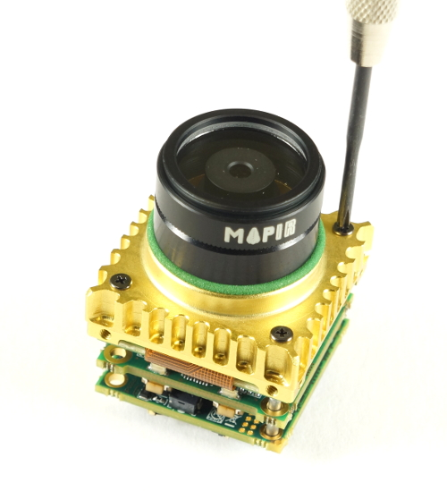
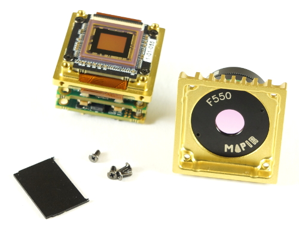
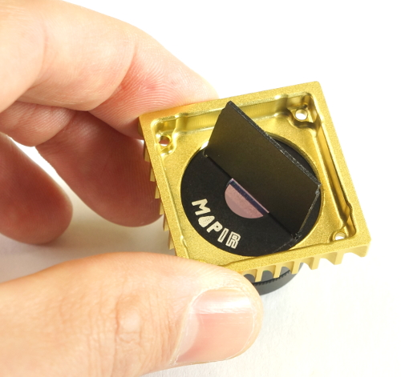
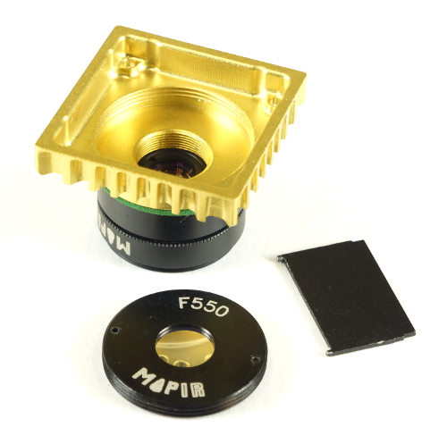

# Kernel Filter Installation

## Kernel Filter Installation

Each filter should come with a small, flat, black, metal key, which is used to install and remove the filter.

### Removing a Kernel Filter

Unscrew the 4 screws holding the top yellow lens mount \(the metal part the lens is threaded into\).

Turn the lens mount over to reveal the filter.

Using the black key, use the two knubs on the end and insert them into the two holes on the filter's black, metal surface.

Turn the filter counter-clockwise to unthread it. Be very careful to apply a lite pressure to the filter such that the knubs stay in the holes and you don't accidentally scratch the filter with the key.

Continue to unthread the filter until it is loose.

### Installing a Kernel Filter

Unscrew the 4 screws holding the top yellow lens mount \(the metal part the lens is threaded into\).

Turn the lens mount over to reveal the filter threading. If a filter is already installed, please see above on how to remove it.

Place the filter onto the lens mount with the MAPIR logo and filter name towards you \(so you can read the writing\).

Using the black filter key, use the two knubs on the end and insert them into the two holes on the filter's black, metal surface.

Turn the filter clockwise to thread it in. Be very careful to apply a lite pressure to the filter such that the knubs stay in the holes and you don't accidentally scratch the filter with the key.

Sometimes it works best to do a clockwise and then counter-clockwise motion until the filter finds the threads.

Continue to thread the filter until it is tight.

## Special Instrucitons for 8.25mm Lens & Kernel Filter Installation

If you are using the 8.25mm lens in the Kernel, you will need to insert a small spacer into the filter threading location prior to threading in the filter.

Make sure there is no filter installed, place the spacer inside the filter location and then proceed with threading in the filter following the instructions above.

If you would like to 3D print your own 8.25mm lens filter spacer you can find the STL [here](http://docs.peauproductions.com/kernel/3d_models/825_spacer_1.0mm.STL).

