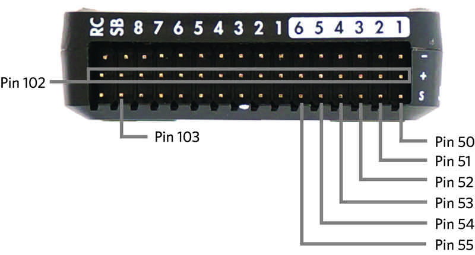

# Relay Trigger From Pixhawk Flight Controller

## Relay Triggering From Pixhawk Flight Controller

**Below is the recommended settings for triggering the Kernel cameras from a GPIO source such as a Pixhawk flight controller.**

## Hardware Settings:

Kernel provides PWM\_IN and PWM\_OUT pins to assist with triggering the camera's shutter as well as outputting exposure feedback for PPK corrections. The location of the PWM\_IN and PWM\_OUT pins depends on which cables or breakout boards you're using with Kernel, so please refer to that hardware documentation for more information.

On the Pixhawk we recommend setting up relay triggering. To do this we suggest the following hardware setup:

#### PWM\_IN = AUX 5 \(Pin 54\)

#### PWM\_OUT = AUX 4 \(Pin 53\)

#### Example on Pixhawk2.1:

Note that on the Pixhawk, there are 3 pin rails, labeled as "-" = ground, "+" = power, "S" = signal. You want to connect the Kernel PWM pins to the S signal pins.

**Purple Wire = PWM\_IN**

**Green Wire = PWM\_OUT**

**Black Wires = GROUND**

## Software Settings:

Sending a relay \(voltage\) spike of 3.3 volts for 2ms is the best way to trigger the Kernel camera. The camera has less chance to miss a trigger because it's looking for any voltage spike for at least 2ms duration.

### Using Mission Planner \(or similar software\), make the following setting changes:

### Under: Config/Tuning &gt; Full Parameter List

**CAM\_FEEDBACK\_PIN = 53**

**CAM\_FEEDBACK\_POL = 1**

**CAM\_RELAY\_ON = 1**

**CAM\_SERVO\_OFF = 1000**

**CAM\_SERVO\_ON = 2000**

**CAM\_TRIGG\_TIME = 0.002**

**CAM\_TRIGG\_TYPE = 1**

**CH7\_OPT = 9**

**RELAY\_DEFAULT = 0**

**RELAY\_PIN = 54**

